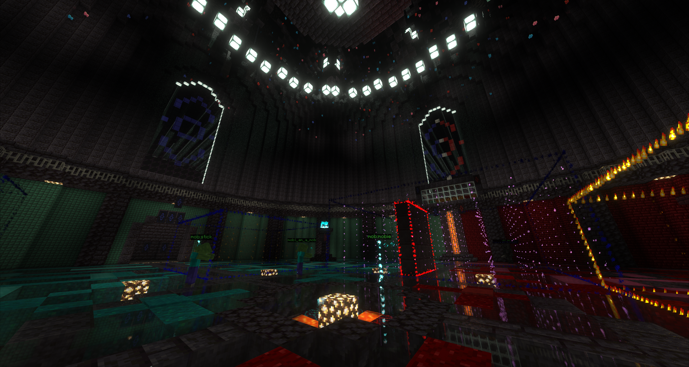

# Instantiated, the better dungeon solution for Minecraft

Instantiated is a plugin designed to enhance gameplay by allowing the creation and customization of dungeons.

Utilizing libraries like WorldEdit, Instantiated provides a robust and flexible platform for instantiating dungeons with custom features such as custom mob spawning, interactive doors, and an intuitive dungeon edit mode.

Mythic mobs is supported, with the mythic-mobs.yml config file. Just add the dungeon mob identifier from in game to the map, with the value being the mythic mob type.

## Dependencies

1. Paper
    > Needed for their library loading at runtime for compatibility with other plugins that may make use of the Kotlin Runtime in Minecraft plugin development.
    > Various Server Optimization

2. FastAsynchronousWorldEdit
    > Needed for fast, efficient, and reliable block changes. Think of all the block changes!

## Features
Instantiated boasts many features, but of course not everything can be done. If you have a request or suggestion, do that in the [discord](https://discord.gg/XggaTq7kjR)

1. Edit mode
        
    > With edit mode, you can customize nearly every facet of a dungeon, while the server is running. Now, some things cannot be done for performance or reliability reasons. In these sparse cases, changes must be done through the dungeons.json file.

2. Supreme error handling
    
    > I like to think that Instantiated has quite nice error handling, making use of StackFrames to deduce the cause of nearly any error. This includes data syntax in the dungeons.json. So don't worry about changing things in there as long as you are ready to read the error and fix it!

## TODO (what i want to add)

* Procedural dungeons
    > Already some backend set up for this, the main issue is actually generating the rooms.
    > Stuff like where rooms connect to each other, how to handle different floors, etc.

* A client mod to replace the server-side editing
    > There is a start made for this, but it is quite the endeavor
    > This will really make configuring dungeons super seamless and FAST
    > Think like axiom 🤤

* SQL support, if there is interest (and reason)

* Multi world / server modes
    > Modes to support multi-world setups, like giving each dungeon its own world for instancing, or each dungeon having its own server. Will look further into these options if interest permits.

* Really, really good documentation (and API)
    > Its only a matter of time to get remarkable documentation. If I could get just one dedicated person to build up the foundation of the documentation, never again would I have to worry about something not being documented.
    
    > This also means I want good javadocs, which can be hard.

* Better in-house mob support
    > Mythic support as is, is not terrible. But without Mythic Mobs, the support is abyssmal. I want to really make Instantiated a plugin capable of handling its own "custom" mobs.

* ### And much more i cannot think of!
    > Please add more things to this list by making a post in `#suggestions` in the [discord](https://discord.gg/XggaTq7kjR)

## Showcase

## Documentation

[documentation is here](devmunky.github.io/Instantiated-Public/)

## Support
Support is provided in the [discord](https://discord.gg/XggaTq7kjR), specifically in the `#create-ticket` channel.

## Credits
##### Created and maintained by DevMunky
##### Thanks for the help Faceguy
##### Thank you ACraftingFish
