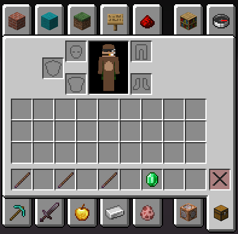
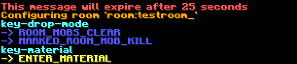

# The edit mode

> The edit mode is a versatile utility that can be accessed with the [command](../usage/commands.md) `/instantiated edit`, or any of its aliases.

Any edit mode functions on the premise that the closest room to you, is the selected room. This may change in the future, and if you want to add any input, please join the [discord](https://discord.gg/XggaTq7kjR) and make a post in `#suggestions`.

#### Therefore, from here on out, the closest room will be referred to as the *selected room*.

All edits with these tools are done in real time. That means you will see changes immediately, yet those changes will only persist once [saved](../usage/commands.md#literal-argument-save). There may be cases where an edit requires all instances of a given dungeon to be reloaded, including cached instances. This happens automatically.

### Edit mode puts four items in your inventory

> When items are put in your inventory with edit mode, your previous inventory is saved. When you exit edit mode, your previous inventory is replaced.

### These four items are *(from left to right)*

1. The room tool
2. The mob tool
3. The door tool
4. The config tool

## Lets begin

- ### The room tool
    >The room tool is used for manipulating the bounds of the selected room.

    Right or left clicking with the tool will inclusively move the closest corner of the selected room to the selected block, if existent. Otherwise, the location of the editor's feet is used.

    The use of inclusively here means that the final interaction (either selected block or editor's location) will always be the *inside* corner of the bounds
- ### The mob tool
    >The mob tool is used for adding or removing mobs in the selected room

    Right clicking with the tool starts the process to create a new mob at the editor's location, including pitch and yaw.

    The editor will then be asked to give the mob an id, or the option to [cancel](../usage/editmode.md#cancelling-chat-inputs)

- ### The door tool

- ### The configuration tool
    >The configuration tool is used for configuring the minute details of a clicked or selected dungeon component

    

    Right or left clicking on a component will ask the editor how they want to configure the component. Options vary depending on the component type.

    > Configuring different components
    >> Configure a door by clicking on it.
    >
    >> Configure a mob by clicking anywhere *except on a door* while standing near the spawn point.
    >
    >> Configure a room by clicking anywhere *except on a door and while not standing near a mob*.
    >
    >> Configure a dungeon by shift clicking anywhere *except on a door and while not standing near a mob*.

    Use the cursor to click on an option, which is a line typically prefixed with `->`  and below a category colored in `aqua`

    These are called `chat questions`

## Cancelling chat inputs

Cancel any chat input, that was asked as a result of an edit tool, by responding with `cancel` or `n`.
> Any components manually named these two words through dungeons.json may have undefined behavior. It is also possible that these words be defined as invalid ids in the future.